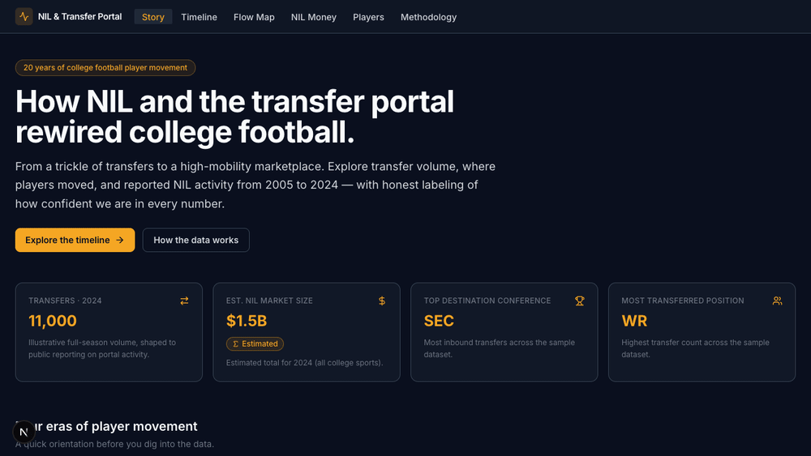
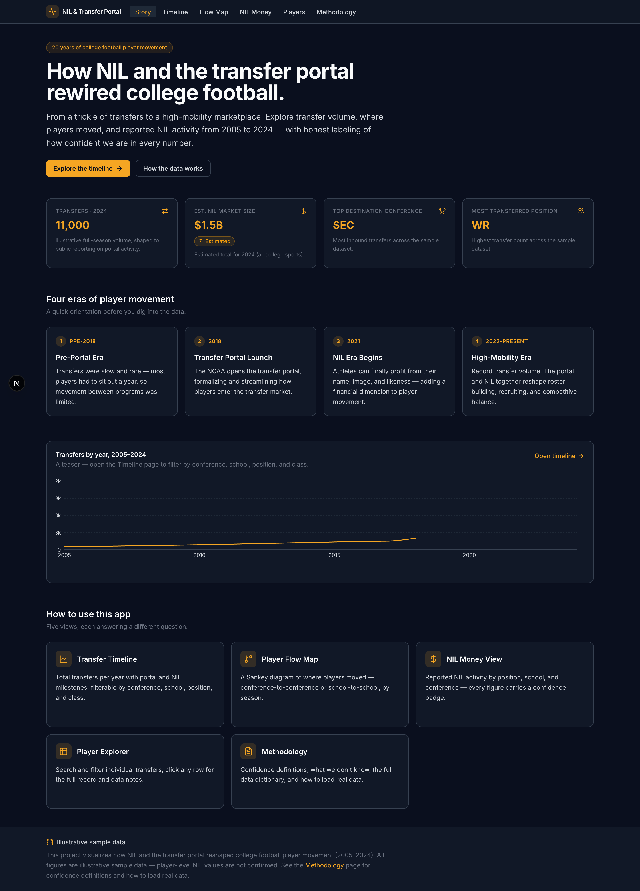
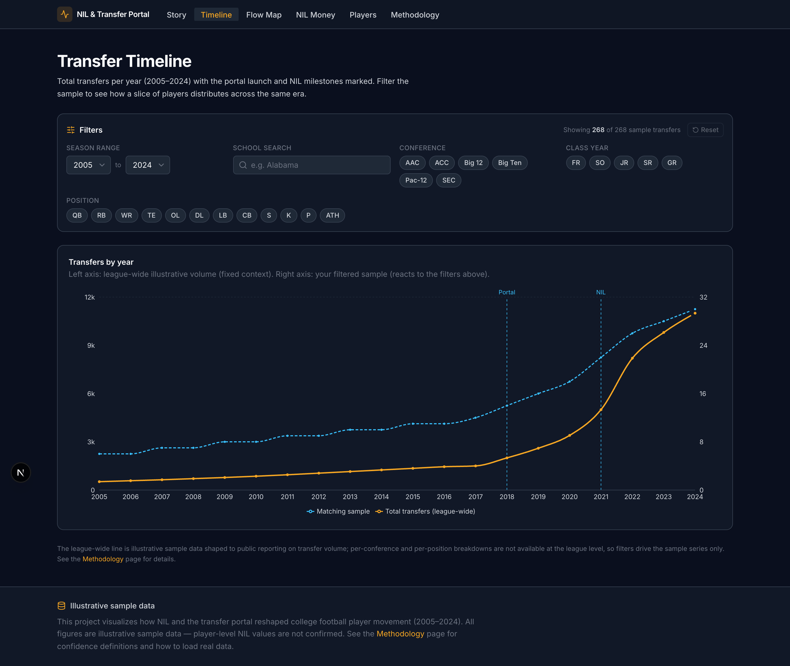
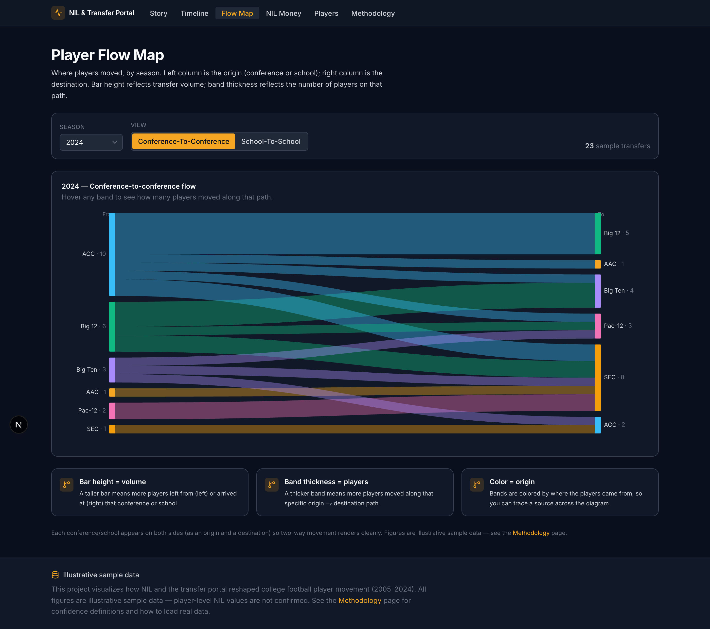
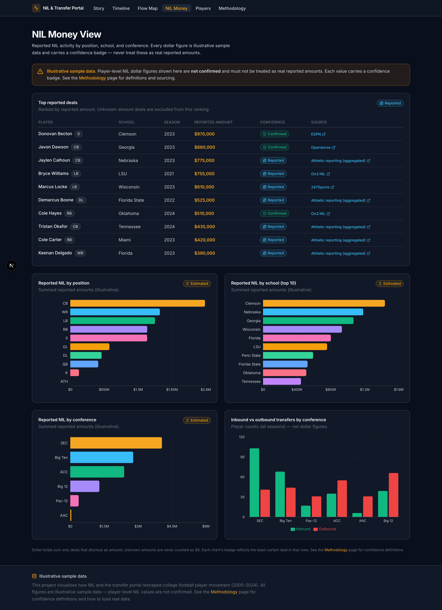
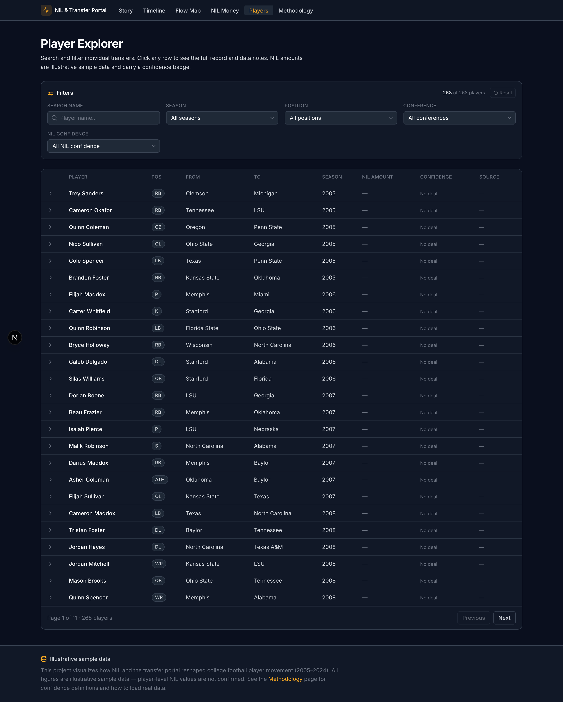
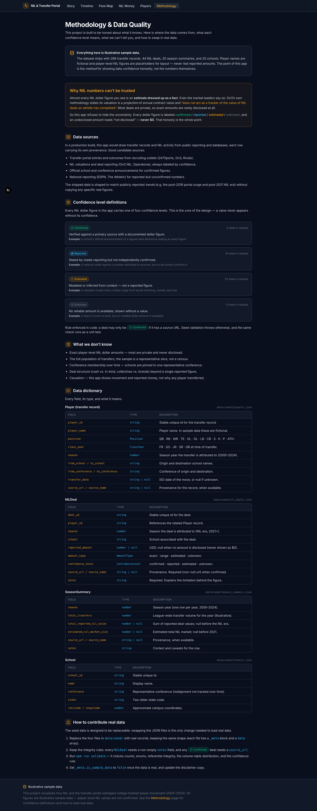

# NIL & Transfer Portal — 20 Years of College Football Player Movement

An interactive data-visualization app that shows how **NIL** (name, image, and
likeness) and the **transfer portal** reshaped college football player movement
from 2005–2024 — built around a single principle: **honest labeling of data
confidence at every level.**

<p align="center">
  
</p>

> ⚠️ **All data in this app is illustrative sample data.** Player names are
> fictional and player-level NIL dollar figures are placeholders — never real
> reported amounts. The point of the project is the *method* for presenting data
> confidence honestly, not the numbers. Every screen says so, and the in-app
> Methodology page (`/methodology`) documents it in full.

---

## What this project does — and doesn't — demonstrate

**It demonstrates:** product thinking about *trust* (confidence-as-a-feature), a
clean strict-TypeScript Next.js app, a pure and unit-tested data layer, a
hand-built bipartite Sankey, real loading/empty/error states, and a validation
suite wired into dev/build/CI.

**It does not (yet) demonstrate analysis of *real* data.** The shipped dataset is
synthetic and deterministic. Consequently, the app's apparent "findings" — e.g.
the top destination conference, NIL-by-conference, the Sankey shape — are
**downstream of a built-in `CONFERENCE_PULL` assumption in
`scripts/generate-seed.ts`, not measured results.** They are labeled as such in
the UI. Likewise, **seed validation guarantees the data is internally consistent
and honestly labeled — it does not (and cannot) prove any figure is accurate.**
The roadmap's first item (real CollegeFootballData ingest) is what would turn
this from a visualization demo into a data project.

A full self-critique lives in [`CRITICAL_REVIEW.md`](CRITICAL_REVIEW.md).

---

## Demo

```bash
git clone https://github.com/johnthesooner/college-football-nil-viz.git
cd college-football-nil-viz
npm install
npm run dev        # http://localhost:3000
```

No environment variables, no database, no secrets — it builds and runs with zero
configuration. (`npm run dev` validates the seed data first via a `predev` hook.)

| Story | Timeline | Flow Map |
|---|---|---|
|  |  |  |
| **NIL Money** | **Players** | **Methodology** |
|  |  |  |

> Regenerate these with `npm run screenshots` (drives local Chrome via
> `puppeteer-core` against a running dev server).

---

## Why this app

The transfer portal (2018) and NIL (2021) turned college football from a
low-mobility world into a free-agency marketplace in just a few years. But the
data around it is **messy and uneven**: transfer counts are roughly known, while
NIL dollar figures range from officially announced to flatly made up.

Most NIL "data" you see online presents estimates as if they were facts. This
app is the opposite: it treats *confidence* as a first-class feature. Every NIL
dollar figure renders next to a **confidence badge** (`confirmed` / `reported` /
`estimated` / `unknown`), undisclosed amounts are shown as "Not disclosed" rather
than `$0`, and the rules are enforced in code — not just promised in a footnote.

---

## Pages

| Route | What it shows |
|---|---|
| `/` | **Story** — era timeline, headline stats, mini trend chart, navigation |
| `/timeline` | **Transfer Timeline** — volume per year with Portal/NIL markers + reactive filters |
| `/flow` | **Flow Map** — Sankey of player movement (conference↔conference or school-to-school) |
| `/nil` | **NIL Money** — top-deals table + bar charts; a confidence badge on every dollar figure |
| `/players` | **Player Explorer** — search, filters, paginated table, expandable detail rows |
| `/methodology` | **Methodology** — confidence definitions, what we don't know, full data dictionary |

---

## Tech stack

| Layer | Choice |
|---|---|
| Framework | Next.js **16.2.9** (App Router, Turbopack) |
| UI | React **19.2.4**, TypeScript **5.9** (strict) |
| Styling | Tailwind CSS **v4** — tokens via `@theme` in `globals.css` (no config file) |
| Charts | Recharts **3** (line/bar) + `d3-sankey` **0.12** for Sankey *layout math only* |
| Icons | lucide-react |
| Testing | Vitest (55 unit tests) |
| Data | local JSON seed files (no database) |

Requires **Node ≥ 20**, **npm ≥ 10** (built and verified on Node 26 / npm 11).

---

## Architecture

- **App Router, mostly static.** All six routes prerender to static HTML; the
  data layer is pure and runs at build time.
- **Pure, tested data layer.** Everything in `lib/data/` is side-effect-free (no
  React, no I/O beyond static JSON imports) and unit-tested. Pages and charts
  consume view-model types, never raw JSON.
- **D3 for math, React for the DOM.** `d3-sankey` computes node/link geometry;
  rendering is plain React SVG. Bidirectional conference flows are mapped onto a
  bipartite source/destination graph so the Sankey is always a DAG (no cycles).
- **Self-measuring charts.** A small `AutoSizer` (ResizeObserver) replaces
  Recharts' `ResponsiveContainer` to avoid measure-at-zero warnings.
- **Confidence as a primitive.** A single `ConfidenceBadge` component and a
  central confidence map drive every dollar figure, the methodology legend, and
  the chart-level "worst confidence in this view" badges.

```
app/            # routes + loading / error / not-found boundaries
components/
  ui/           # ConfidenceBadge, Card, Badge, Skeleton, EmptyState, ErrorBoundary, SourceLink, DataDisclaimer, StatCard …
  charts/       # LineChart, BarChart, SankeyChart, AutoSizer, ChartFrame, palette
  filters/      # FilterBar, ChipMultiSelect, SearchInput, Select, SeasonRange
  layout/       # Nav, Footer, PageHeader
lib/
  types.ts      # all domain + view-model types
  utils.ts      # pure formatting/util helpers (tested)
  constants.ts  # canonical option lists
  data/         # players, nil, seasons, schools, validate (pure, tested)
data/seed/      # players · nil_deals · season_summary · schools (each with a _meta block)
scripts/        # generate-seed · validate-seed · check-sample-data · capture-screenshots
docs/           # REAL_DATA_IMPORT.md · MARKET_ANALYSIS.md · screenshots/
```

---

## The data-confidence model

This is the heart of the project.

| Tier | Badge | Meaning | Rule enforced in code |
|---|---|---|---|
| `confirmed` | 🟢 | Primary source, documented figure | **Must** have a valid `source_url` + `source_name` and a non-null amount |
| `reported` | 🔵 | Cited by reporting, not independently confirmed | **Must** cite a `source_url` or `source_name` |
| `estimated` | 🟠 | Modeled/inferred | May be unsourced, but **never** `amount_type: "exact"` |
| `unknown` | ⚪ | Known to exist, no credible amount | `reported_amount: null`, shown as "Not disclosed" |

`npm run validate` (also a `predev`/`prebuild` hook **and** a Vitest test)
enforces these plus counts, enums, referential integrity, valid http(s) URLs, the
`unknown ⇔ null amount` rule, ≤ 5 `confirmed` deals, and that the sample's
per-season distribution tracks the volume table (Pearson ≥ 0.7). Run
`npm run check:data` to see whether the loaded data is sample or real.

---

## Portfolio Case Study

**The product problem.** College football transfer + NIL data is a textbook
"untrustworthy data" domain: high public interest, real signal on volume, and
near-zero reliability on dollar figures. A naive dashboard would launder
estimates into facts. The product bet here is that *trustworthiness itself* is
the feature — an analyst or fan should always be able to see how much to believe
a number.

**Data caveats (designed-in, not hidden).** The shipped data is illustrative:
fictional names, placeholder NIL amounts, and a 268-row representative sample
(not a census). Rather than bury that, it's surfaced everywhere — a footer
banner, a page-level `DataDisclaimer` on the money view, a confidence badge on
every figure, `_meta.is_sample_data: true` in each file, and a whole Methodology
page. The same honesty rules that protect the sample data are exactly what a real
ingest must satisfy (see `DATA_SOURCES.md`).

**Engineering choices.**
- *Strict TypeScript + a pure data layer* so the visualization logic is testable
  without a browser; charts are thin views over typed view-models.
- *D3-for-math / React-for-DOM* keeps rendering declarative and debuggable, and
  the bipartite Sankey transform sidesteps d3-sankey's no-cycles constraint.
- *Validation in three places* (a script wired to `predev`/`prebuild`, a Vitest
  test, and runtime-safe data access) so bad data fails fast and loudly.
- *Replaceability as a constraint*: the only thing standing between sample and
  real data is four JSON files — the UI never hard-codes a number.

**Roadmap.**
1. Ingest real transfer + school data (College Football Data API) → flip
   `players.json` / `schools.json` to real, keep NIL as labeled estimates.
2. Geographic flow map using the existing `latitude`/`longitude`.
3. Per-season conference membership (handle realignment).
4. Confirmed-deal pipeline: official announcements → `confirmed` rows with sources.
5. Saved/shareable filter states; CSV export with provenance columns.

**Market positioning.** A verified competitive analysis
([`docs/MARKET_ANALYSIS.md`](docs/MARKET_ANALYSIS.md)) found that incumbents
(On3, 247Sports) publish proprietary, paywalled NIL estimates that *they* call
projections — so the unoccupied position is a **free, transparency-first** view
where every figure is labeled by confidence. That's the wedge this app is built
around.

---

## Scripts

```bash
npm run dev          # dev server (validates seed first)
npm run build        # production build (validates seed first)
npm run start        # serve the production build
npm run validate     # seed-data integrity check
npm run test         # Vitest unit suite (55 tests)
npm run lint         # ESLint (zero warnings)
npm run generate:seed   # regenerate the deterministic sample data
npm run check:data      # report SAMPLE vs REAL data status (add -- --require-real to gate)
npm run screenshots     # regenerate docs/screenshots from a running dev server
```

---

## Deployment (Vercel)

Zero-config — Vercel auto-detects Next.js.

**Option A — Dashboard:** push to GitHub, "New Project" on
[vercel.com](https://vercel.com), import the repo, accept defaults, Deploy. No
environment variables to set.

**Option B — CLI:**
```bash
npm i -g vercel
vercel            # preview deploy
vercel --prod     # production deploy
```

Build command `next build`, output handled by the Next.js adapter, Node ≥ 20.
There are **no secrets and no required env vars** (`.env.example` documents this).
The `prebuild` hook runs seed validation, so a broken dataset fails the deploy
build rather than shipping.

---

## Limitations

- **Illustrative sample data** — fictional names, placeholder NIL dollars; not
  for analysis or decisions.
- The 268 player rows are a *representative sample*, not a census; per-season
  counts track the volume table but absolute totals ≠ the league-wide figures on
  the timeline's left axis.
- No persistence/database; static JSON, prerendered.
- No geographic map yet (coordinates exist in the schema, unused).
- Conference membership is pinned to one representative value per school
  (realignment over time is not modeled).

---

## Loading real data

Swapping the four JSON files in `data/seed/` is the only change needed. See
[`docs/REAL_DATA_IMPORT.md`](docs/REAL_DATA_IMPORT.md) for the step-by-step
workflow and [`DATA_SOURCES.md`](DATA_SOURCES.md) for the field schema,
recommended sources, confidence rules, and what cannot be verified.

[`DATA_SOURCES.md`](DATA_SOURCES.md) includes a **verified source evaluation
(2026-06-16)** from a deep-research + adversarial-fact-check pass. The short
version: **[CollegeFootballData (CFBD)](https://collegefootballdata.com/)** is
the one free, key-based, ingestible source for transfers + schools + transfer
volume (free tier, or 3k calls/mo with an `.edu` email), and **[Opendorse's "NIL
at 3" report](https://biz.opendorse.com/)** supplies citable market-size
estimates. On3, 247Sports, and Sports-Reference are **off-limits to scrape or
republish** per their Terms — usable only as manually-cited `estimated`-tier
references. Player-level NIL dollars for private deals stay `estimated`/`unknown`
by design.
